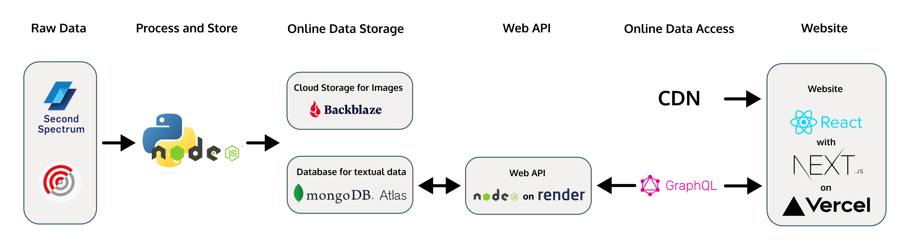

# Kicksmarter

The released website can be access on https://kicksmarter-hackathon-frontend-dud4.vercel.app/, while to access the Web API alone one can visit https://kicksmarter-api-dev.onrender.com/graphql.

## Architecture

To understand the setup it is useful to know the architecture and the tech stack used:



## Running

The project uses npm workspaces, to run the app do:

```
npm run dev:all # both backend and frontend
npm run dev:backend # only backend
npm run dev:frontend # only frontend
```
